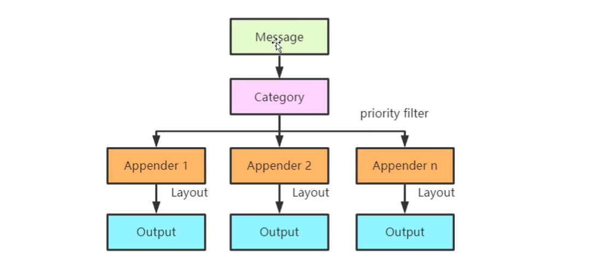
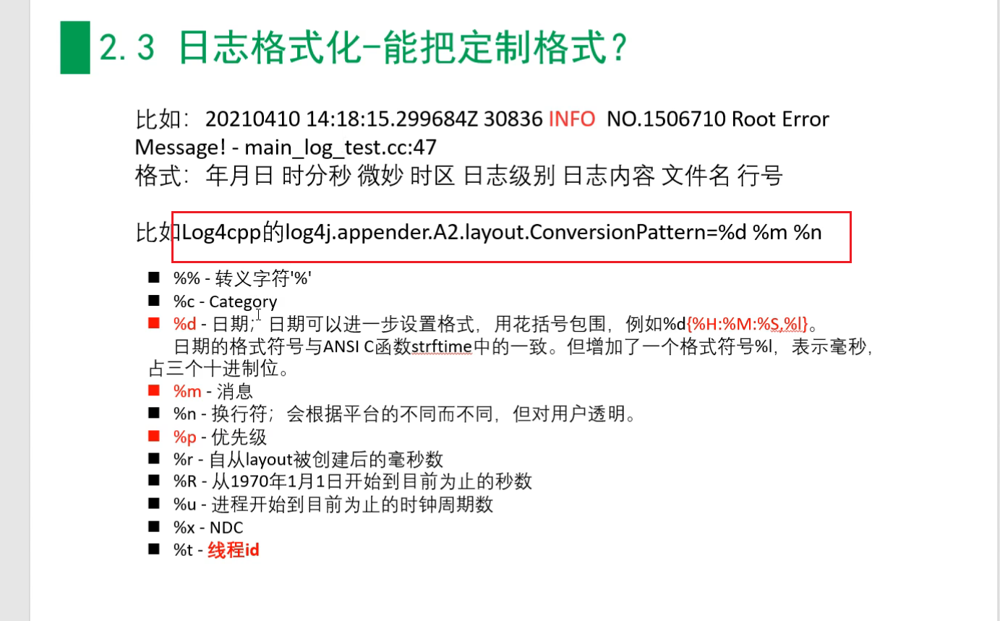
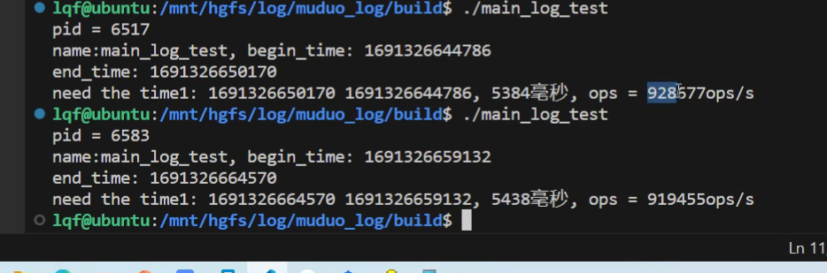
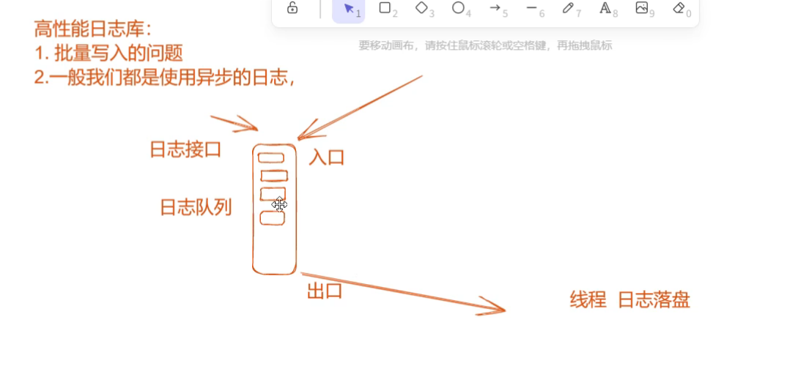
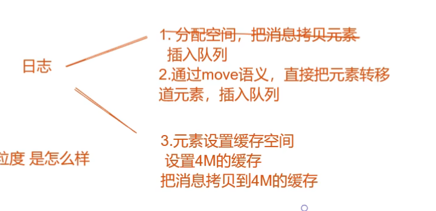

# 多线程异步日志库设计与实现

## 简介

一个日志库大体可以分为前端和后端两个部分。前端是供应用程序使用的接口，并生成日志消息；后端则是负责把日志消息写到目的地，比如终端、文件或者远端。这两部分的接口有可能简单到只有一个回调函数：

```cpp
void output(const char *message, int len);
```

其中的message字符串是一条完整的日志消息，包含日志级别、时间戳、源文件位置、线程 id 等基本字段，以及程序输出的具体消息内容。

在多线程程序种，前端和后端与单线程程序并无明显区别，不过是每个线程都有自己的前端，整个程序共用一个后端。但难点在于将日志数据从多个前端高效地传输到后端。这是一个典型的多生产者-单消费者问题，对于生产者（前端）而言，要尽量做到低延迟、低 CPU 开销、无阻塞；对于消费者（后端）而言，要做到足够大的吞吐量，并占用较少资源。

对 C++ 程序而言，最好整个程序（包括主程序和程序库）都是用相同的日志库，程序有一个整体的日志输出，而不是各个组件都有各自的日志输出。从这个意义上讲，日志库是一个 singleton。

## 功能需求

1. 日志消息支持多种级别，如 TRACE、DEBUG、INFO、WARN、ERROR、FATAL 等；
2. 以本地文件作为日志目的地，日同时支持志文件的滚动；
3. 日志消息的格式是固定的，不需要运行时配置，这样可节省每条日志解析格式字符串的开销。日志消息格式有以下要点：
   - 尽量每条日志占用一行L;
   - 时间戳精确到微秒。每条消息通过 `gettimeofday(2)` 获取当前时间，这样做不会有性能损失。因为在 x86-64 Linux 上，它不是系统调用，不会陷入内核;
   - 始终使用 GMT 时区(Z);
   - 打印线程 id；
   - 打印日志级别；
   - 打印源文件和行号。

## 性能需求

编写 Linux 服务端程序时，我们需要一个高效的日志库。只有日志库足够高效，程序员才敢在代码种输出足够多的诊断信息，减少运维难度，提升效率。高效性体现在几个方面

- 每秒写几千上万条日志的时候没有明显的性能损失；
- 能应对一个进程产生大量日志数据的场景，例如 1GB / min；
- 不阻塞正常的执行流程；
- 在多线程程序中，不造成争用。

具体地讲，可以以磁盘带宽作为日志库的性能指标：日志库应该能够在瞬时写满磁盘带宽。

## 多线程异步日志

## 优化技术

### 线程局部存储

C++11通过`thread_local`关键字来支持线程局部存储。通过`thread_local`创建的变量，每个线程都有一份独立实体，各个线程的变量值互不干扰。

`thread_local` 变量通常用于需要在线程之间保持状态或信息隔离的情况。以下是一个示例，演示如何使用 `thread_local` 变量来实现线程安全的计数器：

```cpp
#include <iostream>
#include <thread>

// 声明一个 thread_local 变量，每个线程都有独立的副本
thread_local int threadCounter = 0;

// 递增计数器的函数
void IncrementCounter() {
   ++threadCounter;
}

// 打印线程的 ID 和计数器的值
void PrintThreadIdAndCounter() {
   std::cout << "线程ID: " << std::this_thread::get_id() << ", 计数器值: " << threadCounter << std::endl;
}

int main() {
   // 创建多个线程来递增计数器
   std::thread t1([](){
      IncrementCounter();
      PrintThreadIdAndCounter();
   });

   std::thread t2([](){
      IncrementCounter();
      PrintThreadIdAndCounter();
   });

   // 等待线程完成
   t1.join();
   t2.join();

   // 主线程中的计数器值也是独立的
   PrintThreadIdAndCounter();

   return 0;
}
```

在这个示例中，我们声明了一个 `thread_local` 整数变量 `threadCounter`，它的值在每个线程中都有独立的副本。我们创建了两个线程 `t1` 和 `t2`，每个线程调用 `IncrementCounter()` 函数来递增自己的计数器副本，然后调用 `PrintThreadIdAndCounter()` 函数来打印线程ID和计数器的值。

由于 `thread_local` 变量的特性，每个线程的计数器值都是独立的，不会相互干扰。主线程中的计数器值也是独立的。这种方式可以用于在线程之间隔离状态或信息，确保线程安全性。

请注意，`std::this_thread::get_id()` 函数用于获取当前线程的ID，以便在打印时标识不同的线程。在实际应用中，`thread_local` 变量可以用于更复杂的情况，如线程池中的任务状态跟踪等。


Layout: 日志输出格式

Appender: 日志输出，比如控制台、磁盘log、网络

日志性能: qps

火焰图

异步日志库分析
百万qps


批量写入的问题；
一般我们都是使用异步的日志







