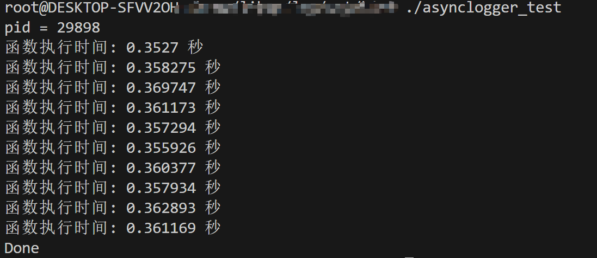

# 多线程异步日志库设计与实现

## 前言

一个日志库大体可以分为前端和后端两个部分。前端是供应用程序使用的接口，并生成日志消息；后端则是负责把日志消息写到目的地，比如终端、文件或者远端。这两部分的接口有可能简单到只有一个回调函数：

```cpp
void output(const char *message, int len);
```

其中的message字符串是一条完整的日志消息，包含日志级别、时间戳、源文件位置、线程 id 等基本字段，以及程序输出的具体消息内容。

在多线程程序中，前端和后端与单线程程序并无明显区别，不过是每个线程都有自己的前端，整个程序共用一个后端。但难点在于如何将日志数据从多个前端高效地传输到后端。这是一个典型的多生产者-单消费者问题，对于生产者（前端）而言，要尽量做到低延迟、低 CPU 开销、无阻塞；对于消费者（后端）而言，要做到足够大的吞吐量，并占用较少资源。

对 C++ 程序而言，最好整个程序（包括主程序和程序库）都是用相同的日志库，程序有一个整体的日志输出，而不是各个组件都有各自的日志输出。从这个意义上讲，日志库是一个 singleton。

## 功能需求

1. 日志消息支持多种级别，如 TRACE、DEBUG、INFO、WARN、ERROR、FATAL 等；
2. 以终端和本地文件作为日志目的地，同时支持日志文件的滚动；
3. 日志消息的格式是固定的，不需要运行时配置，这样可节省每条日志解析格式字符串的开销。日志消息格式有以下要点：
   - 尽量每条日志占用一行;
   - 时间戳精确到微秒。每条消息通过 `gettimeofday(2)` 获取当前时间，这样做不会有性能损失。因为在 x86-64 Linux 上，它不是系统调用，不会陷入内核;
   - 始终使用 UTC 时间;
   - 打印线程 id；
   - 打印日志级别；
   - 打印源文件和行号。

## 性能需求

编写 Linux 服务端程序时，我们需要一个高效的日志库。只有日志库足够高效，程序员才敢在代码中输出足够多的诊断信息，减少运维难度，提升效率。高效性体现在几个方面

- 每秒写几千上万条日志的时候没有明显的性能损失；
- 能应对一个进程产生大量日志数据的场景，例如 1GB / min；
- 不阻塞正常的执行流程；
- 在多线程程序中，不造成争用。

具体地讲，可以以磁盘带宽作为日志库的性能指标：日志库应该能够在瞬时写满磁盘带宽。

## 多线程异步日志库设计

### 类图


上面就是整个日志库的类设计图。`Logger`类负责接收前端的日志并做格式化，然后将格式化的日志输出到用户指定的目的地；`AsyncLogging`类负责接收前端的日志，并调用相关的接口将日志进行落盘；`LogFile`负责日志定期落盘和支持日志滚动；`AppendFile`则负责实际的日志数据落盘和刷新用户缓存。

### 状态图

以下给出一条日志从前端到后端落盘整个流程的状态图。


- 首先，用户使用`Logger`的`stream()`接口进行日志输出，输出方式类似于`std::cout`;
- 然后，`Logger`对用户日志进行格式化，添加时间、线程id等信息。然后调用`AsyncLogging`的`append()`接口将格式的日志传递到后端。这里实际上是输出到缓冲中并唤醒后端日志线程，就直接返回了。
- `AsyncLogging`会定期从缓冲中读取日志，调用`LogFile`的`append()`接口进行日志落盘；
- 最后，`LogFile`实际上是调用`AppendFile`的`append()`完成实际的日志数据落盘。

## 优化技术

### 双缓冲技术

在实现中，我们采用了两个缓冲区数组`buffers_`和`buffersToWrite`, 还有用于额外缓冲的四个缓冲区`currentBuffer_`、`nextBuffer_`、`newBuffer1`、`newBuffer2`。用户日志是先写到`currentBuffer_`中，等写满后再‘转移’到`buffers_`中。具体代码如下：

```cpp
void AsyncLogging::Impl::append(const char *logline, size_t len) {
  std::lock_guard<std::mutex> guard(mutex_);
  assert(currentBuffer_ != nullptr);
  if (currentBuffer_->avail() > len) {
    currentBuffer_->append(logline, len);
  } else {
    buffers_.push_back(std::move(currentBuffer_));

    if (nextBuffer_) {
      currentBuffer_ = std::move(nextBuffer_);
    } else {
      currentBuffer_.reset(new Buffer);
    }

    currentBuffer_->append(logline, len);
    cond_.notify_one();
  }
}
```

在添加`currentBuffer_`到`buffers_`之后，会唤醒后端日志线程去写日志。后端日志线程在被前端唤醒之后，会读取并‘交换’`buffers_`中的日志到`buffersToWrite`中。然后调用`LogFile`的`append()`接口完成日志落盘。具体代码如下：

```cpp
void AsyncLogging::Impl::threadFunc() {
  LogFile output(basename_, rollSize_);

  // 后备缓冲区
  BufferPtr newBuffer1(new Buffer);
  BufferPtr newBuffer2(new Buffer);
  newBuffer1->bzero();
  newBuffer2->bzero();

  BufferVector buffersToWrite; // 与buffers_组成双缓冲
  buffersToWrite.reserve(NUM_BUFFERS);

  // 从 buffers_ 读取格式化后的日志
  while (running_) {
    {
      std::unique_lock<std::mutex> lock(mutex_);
      if (buffers_.empty()) {
        cond_.wait_for(lock, std::chrono::seconds(flushInterval_));
      }
      buffers_.push_back(std::move(currentBuffer_));
      currentBuffer_ = std::move(newBuffer1);
      buffersToWrite.swap(buffers_);
      if (!nextBuffer_) {
        nextBuffer_ = std::move(newBuffer2);
      }
    }
    // 写日志文件
    for (auto &buffer : buffersToWrite) {
      output.append(buffer->data(), buffer->length());
    }

    // 更新newBuffer1、newBuffer2
    if (buffersToWrite.size() > 2) {
      buffersToWrite.resize(2);
    }

    if (!newBuffer1) {
      newBuffer1 = std::move(buffersToWrite.back());
      buffersToWrite.pop_back();
      newBuffer1->reset();
    }

    if (!newBuffer2) {
      newBuffer2 = std::move(buffersToWrite.back());
      buffersToWrite.pop_back();
      newBuffer2->reset();
    }

    buffersToWrite.clear();
    output.flush();
  }
  output.flush();
}
```

通过代码实现，我们可以清晰地看出。在使用双缓冲技术之后，新建日志消息的时候便不会等待磁盘文件操作，也避免了每条日志消息都唤醒后端日志线程。而且我们可以批量写入日志数据，进一步提升磁盘I/O。

### 增大fwrite缓冲池


以上是一个文件各级缓冲的示意图。在`glibc`中默认用户缓冲区大小为`#define BUFSIZ 8192`，并且缓冲类型设置为全缓冲`_IOFBF`。也就是说当写满8192字节的用户缓冲后，就会调用`fflush/write`将用户缓冲区的数据写到内核缓冲。考虑到这一步涉及到昂贵的系统调用开销，我们的日志库决定增大用户缓冲区的大小。具体实现如下：

```cpp
constexpr int32_t FILE_BUFS_IZE = 64 * 1024;
char buffer_[FILE_BUFS_IZE];

setbuffer(fp_, buffer_, sizeof buffer_);
```

既然增大了缓冲，就有可能出现程序崩溃，用户缓冲的日志数据丢失的情形。因此，我们采用日志数据定期刷新的策略。在实现上，专门由一个后台线程周期性的进行缓冲刷新。具体代码如下：

```cpp
void LogFile::Impl::flushThreadFunc() {
  while (running_) {
    std::this_thread::sleep_for(std::chrono::seconds(flushInterval_));
    flush();
  }
}
```

### 线程局部存储

C++11通过`thread_local`关键字来支持线程局部存储。通过`thread_local`创建的变量，每个线程都有一份独立实体，各个线程的变量值互不干扰。

`thread_local` 变量通常用于需要在线程之间保持状态或信息隔离的情况。以下是一个示例，演示如何使用 `thread_local` 变量来实现线程安全的计数器：

```cpp
#include <iostream>
#include <thread>

// 声明一个 thread_local 变量，每个线程都有独立的副本
thread_local int threadCounter = 0;

// 递增计数器的函数
void IncrementCounter() {
   ++threadCounter;
}

// 打印线程的 ID 和计数器的值
void PrintThreadIdAndCounter() {
   std::cout << "线程ID: " << std::this_thread::get_id() << ", 计数器值: " << threadCounter << std::endl;
}

int main() {
   // 创建多个线程来递增计数器
   std::thread t1([](){
      IncrementCounter();
      PrintThreadIdAndCounter();
   });

   std::thread t2([](){
      IncrementCounter();
      PrintThreadIdAndCounter();
   });

   // 等待线程完成
   t1.join();
   t2.join();

   // 主线程中的计数器值也是独立的
   PrintThreadIdAndCounter();

   return 0;
}
```

在这个示例中，我们声明了一个 `thread_local` 整数变量 `threadCounter`，它的值在每个线程中都有独立的副本。我们创建了两个线程 `t1` 和 `t2`，每个线程调用 `IncrementCounter()` 函数来递增自己的计数器副本，然后调用 `PrintThreadIdAndCounter()` 函数来打印线程ID和计数器的值。

由于 `thread_local` 变量的特性，每个线程的计数器值都是独立的，不会相互干扰。主线程中的计数器值也是独立的。这种方式可以用于在线程之间隔离状态或信息，确保线程安全性。

请注意，`std::this_thread::get_id()` 函数用于获取当前线程的ID，以便在打印时标识不同的线程。在实际应用中，`thread_local` 变量可以用于更复杂的情况，如线程池中的任务状态跟踪等。

在该日志库实现时，对于每条日志，我们都需要获取线程id和将线程id转换为字符串的，这是非常耗时的。因此，我们采用`thread_local`关键字来声明这两个变量，并仅在第一次调用`pthread_self()`获取线程id和将线程id转换为字符串，后面直接使用缓存的结果。

## 测试结果

直接上测试demo。在demo中我们每次写入一百万条日志，循环十次，观察波动情况。

```cpp
constexpr int kBatch = 1000000;
for (int t = 0; t < 10; ++t) {
   clock_t start = clock();

   for (int i = 0; i < kBatch; ++i) {
   LOG_INFO << "Hello 0123456789"
            << " abcdefghijklmnopqrstuvwxyz "
            << cnt;
   ++cnt;
   }
   // 获取结束时间点
   clock_t end = clock();
   // 计算处理器时间差
   double cpu_time_used = static_cast<double>(end - start) / CLOCKS_PER_SEC;
   // 输出执行时间
   std::cout << "函数执行时间: " << cpu_time_used << " 秒" << std::endl;
}
```

以下是测试结果。可以看出，百万条日志的写入时间均在`1s`以内。


## 参考

[1] [setvbuf](https://en.cppreference.com/w/c/io/setvbuf)
[2] Linux 多线程服务器端编程：使用 muduo C++ 网络库
