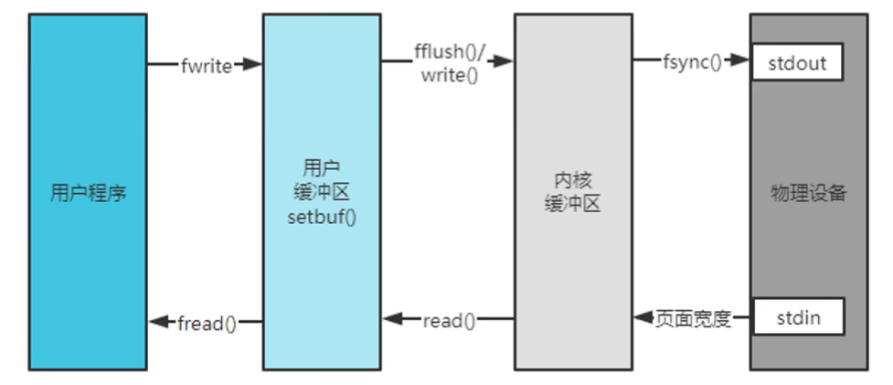

# 日志相关基础知识介绍

## 可变参数

### 基本用法

C语言中可变参数（Variable Arguments）是一种特殊的参数传递方式，允许函数接受不定数量的参数。这在处理不同数量的参数或参数类型的情况下非常有用，比如printf函数就使用了可变参数来支持不同数量和类型的输出。

可变参数的使用通常依赖于标准库中的stdarg.h头文件，该头文件提供了一组宏和函数来处理可变参数。

以下是C语言中使用可变参数的基本步骤：

1. 包含头文件。你需要包含头文件stdarg.h来使用可变参数。

    ```c
    #include <stdarg.h>
    ```

2. 定义一个函数，其中包含可变参数：函数的声明和定义中，你可以使用省略号(...)来表示可变参数。通常，至少需要一个固定参数，以确定可变参数的类型和数量。

```c
#include <stdio.h>
#include <stdarg.h>

// 一个接受可变参数的函数示例
int sum(int count, ...) {
    va_list args;             // 创建一个va_list类型的变量
    va_start(args, count);    // 初始化args，count是最后一个固定参数
    int result = 0;

    for (int i = 0; i < count; i++) {
        int num = va_arg(args, int);  // 读取下一个可变参数，这里假设参数都是int类型
        result += num;
    }

    va_end(args);  // 结束可变参数的处理

    return result;
}

int main() {
    int total = sum(3, 10, 20, 30);
    printf("总和：%d\n", total);
    return 0;
}
```

在上述示例中，sum函数接受一个整数count，然后使用可变参数来接受count个整数并将它们相加。

请注意，可变参数的处理通常需要使用`va_list`、`va_start`、`va_arg`和`va_end`这几个宏和函数来进行操作。另外，你需要了解函数调用时可变参数的数量和类型，以便正确地处理它们。

在实际应用中，可变参数非常有用，但也需要小心使用，以避免内存访问错误和类型不匹配的问题。

### 注意事项

#### `va_start`和`va_end`必须匹配使用

`va_start`和`va_end`必须匹配使用。这两个宏用于处理可变参数的开始和结束，它们必须成对出现在同一个函数内。具体来说：

1. `va_start`（可变参数开始）用于初始化`va_list`对象，以便开始访问可变参数。它需要两个参数：`va_list`对象和最后一个固定参数的名称。这个宏告诉编译器从哪里开始处理可变参数。

2. `va_end`（可变参数结束）用于结束对可变参数的访问，清理相关资源。它只需要一个参数，即之前初始化的`va_list`对象。这个宏告诉编译器停止访问可变参数。

下面是一个示例，演示了如何正确使用`va_start`和`va_end`：

```c
#include <stdio.h>
#include <stdarg.h>

void print_integers(int count, ...) {
    va_list args;
    va_start(args, count);

    for (int i = 0; i < count; i++) {
        int num = va_arg(args, int);
        printf("%d ", num);
    }

    va_end(args);
    printf("\n");
}

int main() {
    print_integers(3, 10, 20, 30);
    return 0;
}
```

在这个示例中，`va_start`用于初始化`args`，然后在循环中使用`va_arg`读取可变参数，最后使用`va_end`来结束可变参数的处理。这确保了资源的正确释放和参数的正确处理。如果不成对使用`va_start`和`va_end`，可能会导致未定义的行为和内存泄漏等问题。

#### 为什么要加`##`

诸如如下的情况，这里我们在`args`参数前加了`##`。

```cpp
#define TRACE_LOG(_fmt_, args...)                                              \
  LoggerFactory::getInstance()->getRootLogger()->trace(_fmt_, ##args)
```

`##` 是预处理器中的一个特殊运算符，通常用于宏定义中，用于处理可变参数。它的作用是将可变参数与前面的标识符或文本连接在一起，以生成有效的代码。

在上下文中，为什么要使用 `##` 呢？原因如下：

1. **处理可变参数列表（variadic arguments）：** 宏定义中的 `args...` 表示可变参数列表，也就是一个不定数量的参数。在宏展开时，这些参数会被替换为传递给宏的实际参数。但是，在某些情况下，如果没有参数传递给宏，那么 `args` 本身就会成为一个单独的参数。通过在 `args` 前面加上 `##`，可以确保在没有实际参数传递给宏时，`args` 不会留下多余的逗号或错误。这样，宏可以更容易地适应各种使用场景。

考虑以下示例，它演示了 `##` 的用法：

```c
#include <cstdio>
#include <stdarg.h>
#define LOG(format, ...) printf(format, ##__VA_ARGS__)

int main() {
    LOG("Hello, %s!\n", "world");
    LOG("This is a number: %d\n", 42);
    return 0;
}
```

在上述示例中，`LOG` 宏使用 `##` 来处理可变参数，以确保在没有参数传递给宏时，不会留下多余的逗号。这使得宏在不同的调用场景下都能正常工作。

## fwrite、write的区别

测试 fwrite、write 写日志情况，fwrite 用户缓冲默认大小为 8192 bytes。


打断点

## 参考

[1] [setvbuf](https://en.cppreference.com/w/c/io/setvbuf)
